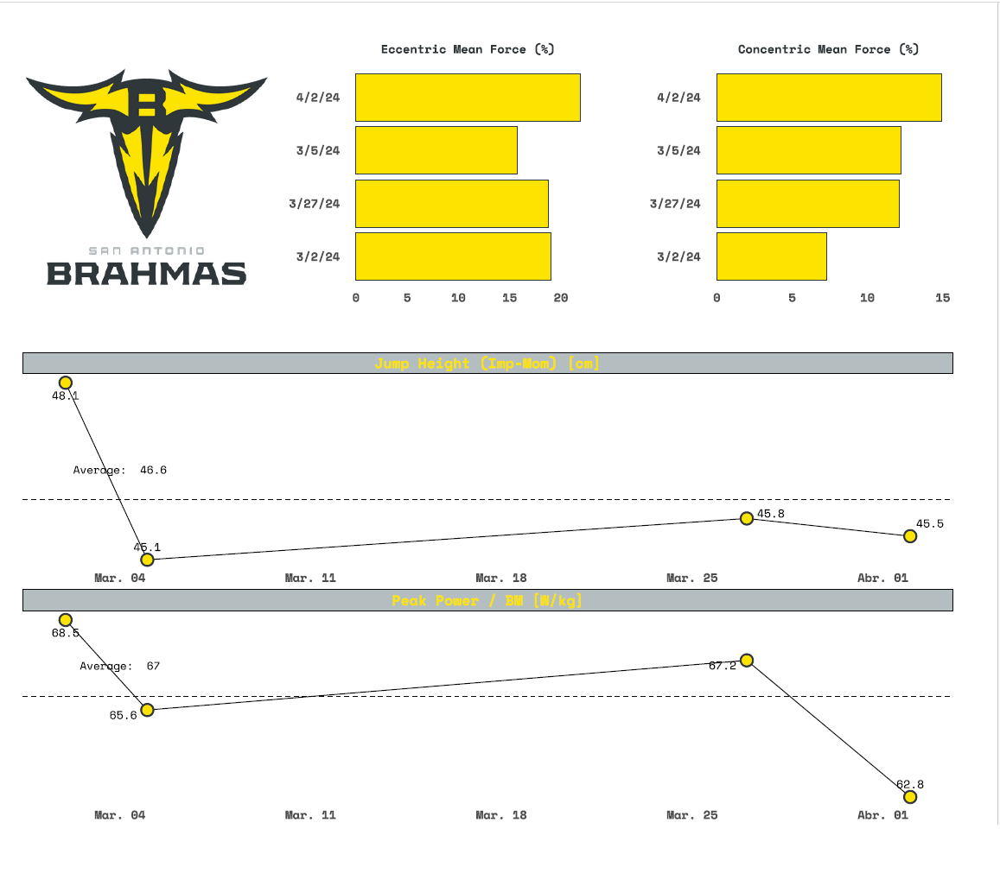
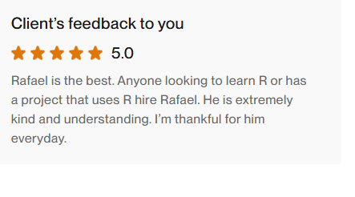
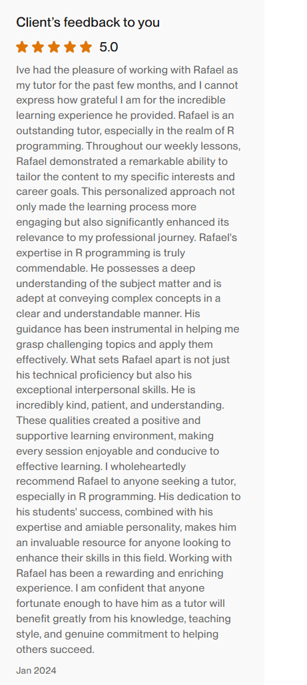

This year I created a course for a Sports Scientist that wanted to get into R. I taught the course in english via zoom once a week. This is a short clip from one of the workshops. I also developed a simple [course website](https://r4ds-sports.netlify.app/). 

The course is an introduction to R with examples from Sports Science. Most of the examples are from [this book](https://www.amazon.com/Basketball-Data-Science-Applications-Chapman/dp/1138600792). The client wanted me to help on a project, so I create some visualizations for him also using `ggplot`:

All in all, this was a terrific experience. This is the client's feedback:

{.centered-image}

{.centered-image}

