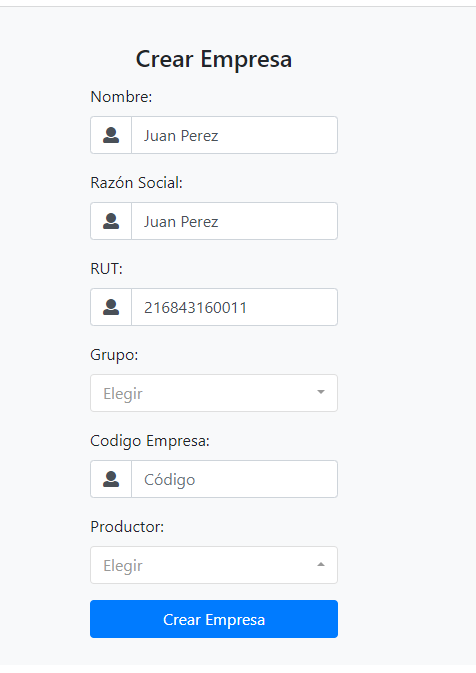
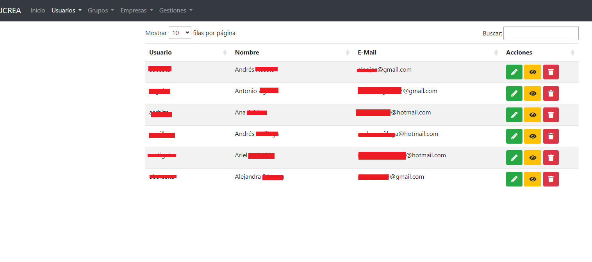
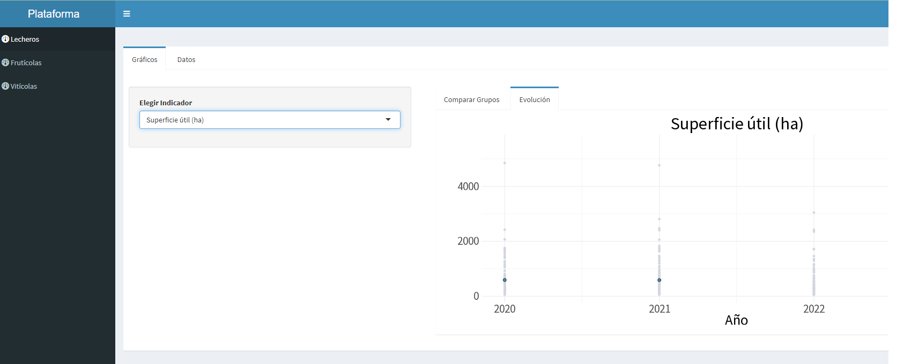
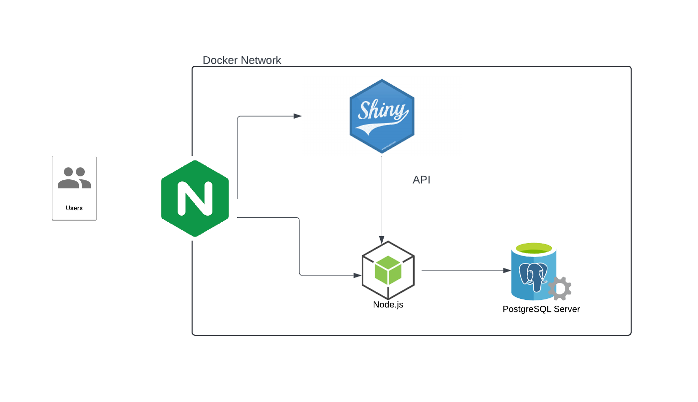

## El proyecto

FUCREA es una organización que nuclea a más de 500 productores rurales de Uruguay. Estos productores se organizan en grupos, que tienen un asesor que releva información de resultados productivos y económicos de las empresas. 

El objetivo de este proyecto es facilitar el uso de estos datos para la toma de decisiones, generando análisis y visualizaciones de estos datos. Los principales desafíos del proyecto son diseñar un mecanismo de autorización que refleje la lógica de negocios de FUCREA y garantice que los usuarios solo acceden a la información para la que tienen permisos, y desarrollar las visualizaciones interactivas de los datos de manera que permitan a los usuarios sacar conclusiones valiosas a partir de la información disponible.

Los grupos CREA estan organizados por sectoriales que agrupan empresas de rubros similares (ganaderas, lecheras, agrícolas). A su vez, las sectoriales se dividen en grupos de 10 o 20 empresas, que reciben asistencia técnica de un asesor. Esto hace necesario que el sistema tenga mútiples roles con permisos diferenciados: los coordinadores generales pueden acceder a todos los datos, los coordinadores sectoriales solo a los de las empresas de su sector, los asesores solo pueden acceder a empresas de sus grupos y los productores solo pueden acceder a los datos de sus empresas. 

A su vez, este esquema jerárquico debe permitir que hay asesores que tienen varios grupos, productores con más de una empresa, etc. Estas relaciones dinámicas son administradas por el staff de FUCREA en una aplicación Web y una base de datos relacional.

El dashboard consume información de la base de datos a través de una API, por lo que los cambios que los asesores realizan a través de la aplicación Web se reflejan en tiempo real en el dashboard.

La solución combina R y Shiny con Node usando Docker para garantizar la seguridad y privacidad de los datos, implementando un modelo de autorización que refleja la lógica de negocio, y permite visualizarlos en una aplicación interactiva. 

Este año presenté este proyecto en LatinR, acá se puede ver la presentación donde detallo bastante como es la implementación:

<iframe width="560" height="315" 
        src="https://www.youtube.com/embed/PIhd73jFZZQ" 
        title="YouTube video player" 
        frameborder="0" 
        allow="accelerometer; autoplay; clipboard-write; encrypted-media; gyroscope; picture-in-picture" 
        allowfullscreen>
</iframe>

