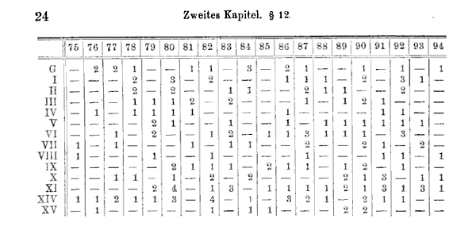

```{r warning=FALSE, message=FALSE, echo=FALSE}
suppressPackageStartupMessages({
  library(dplyr)
  library(tibble)
  library(ggplot2)
  library(showtext)
})

font_add_google(name = "EB Garamond", family = "EB Garamond")
font_add_google(name = "IBM Plex Sans", family = "IBM Plex Sans")
showtext_auto()
theme_set(
  theme_minimal(base_family = "EB Garamond") +
    theme(
      plot.title = element_text(family = "IBM Plex Sans", color = "#2B2B2B"),
      plot.subtitle = element_text(family = "IBM Plex Sans", color = "#2B2B2B"),
      axis.title = element_text(size = 16),
      axis.text = element_text(size = 14),
      legend.title = element_text(size = 14),
      legend.text = element_text(size = 13)
    )
)
```


En la época de la guerra Franco-Prusiana, los prusianos llevaban registros detallados de la muerte de los soldados. Cada vez que un caballo mataba a a un soldado de una patada, quedaba registrado:



Los datos estan disponibles en un paquete de R:

```{r warning=FALSE, message=FALSE, echo=FALSE}


library(Horsekicks)

patadas <- hkdeaths |> 
  filter(between(year, 1875, 1894)) |> 
  tibble::as_tibble()

head(patadas)
```

Cada fila corresponde a un cuerpo-año, y las columnas muestran cuantos muertos hubo por cada causa (también hay datos de ahogamientos y caídas). Hay datos de XX cuerpos para los 20 años, por lo que el data frame tiene XX filas y `r sum(patadas$kick)` muertes entre 1875 y 1894. 

Si contamos las muertes por cada cuerpo-año, vemos que las muertes por patada de caballo son raras: en cada cuerpo de caballería, lo más probable es que en un año determinado no haya soldados muertos:

```{r message=FALSE, warning=FALSE, echo=FALSE}
cuentas <- patadas |> 
  group_by(year, corps) |> 
  summarise(muertes=(sum(kick))) |> 
  ungroup() |> 
  count(muertes)

cuentas |> 
  ggplot(aes(muertes, n)) +
  geom_col(fill = "#1E1C1A") +
  labs(x="Muertes por patada", y="N")

```

Ladislaus von Bortkeiwicz descubrió que la distribución Poisson se ajusta bastante a los datos. Esta distribución sirve cuando los eventos suceden en forma independiente, los eventos son raros y la tasa de ocurrencia del evento es constante.

$$ X \sim \operatorname{Poisson}(\lambda) $$
$$ P(X=x) = \frac{e^{-\lambda}  \lambda^x}{x!} $$
Para mostrar eso hizo dos cosas: 1) calculó el valor de $\lambda$ en base a los datos obervados, y 2) comparó la distribución observada con la teórica. El valor de lambda es la tasa promedio de muertes. La comparación la hizo "a ojo":


Hacemos lo mismo en R:
```{r}
lambda <- .7
n <- sum(cuentas$n)
cuentas <- cuentas |> 
  mutate(pred=round(exp(-lambda)*lambda^muertes/factorial(muertes)*sum(n))) |> 
  tidyr::pivot_longer(-muertes)

cuentas |> 
  ggplot(aes(muertes, value, fill=name)) + 
  geom_col(position="dodge") +
  scale_fill_manual("",
    values = c("#1E1C1A", "#6E6B68")) +
  labs(x="Muertes por patada", y="N")
```
